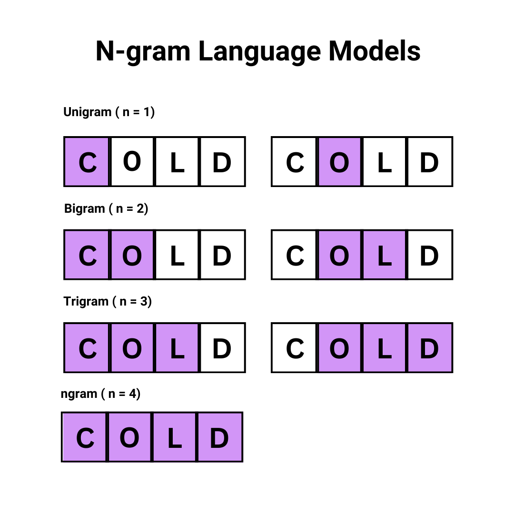

# N-grams

**N-grams** are sequences of 'n' tokens from a given sample of text.

By analyzing these sequences, we can understand how words are commonly used together. This is essential for tasks like predicting the next word in a sentence or understanding the meaning of text.

There are three popular models of n-grams:

We use teh n-gram model above for the word "Cold". We can also use this model for phrases or sentences.

- Unigram, for a single character or word (e.g., "I")
- Bigram, for two consecutive characters or words (e.g., "I Am")
- Trigram, for three consecutive characters or words (e.g., "I am learning")

N-grams analyze the probability of certain word sequences based on their occurence typically in a large dataset. FOr example a bigram model counts how often two words occur together and assigns a probabilty to them. This helps in predicting or generating text.